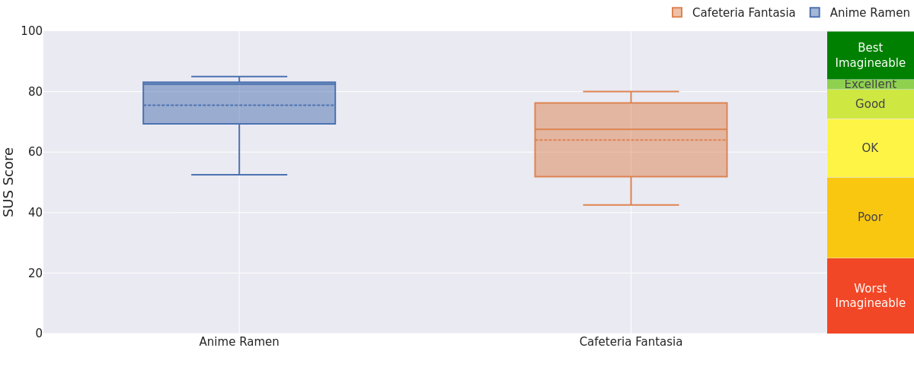
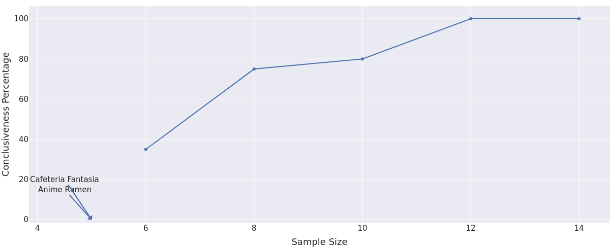
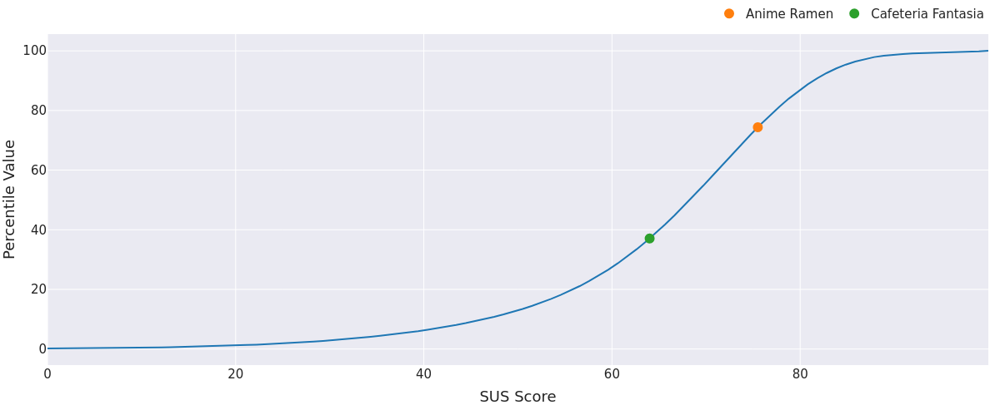

# Usability Report

### Evaluación de usabilidad del proyecto  [Anime Ramen]

[24 de mayo de 2026]

[[Enlace a GITHUB del proyecto](https://github.com/JavierRG6/DIU1.HustleHard.git)]

### Realizado por: Wax&Wayne (DIU2)

En esta evaluación hemos analizado el proyecto de otro equipo aplicando técnicas de UX Research. Nuestra experiencia previa en evaluación de usabilidad se limita al marco académico de la asignatura, lo que nos ha permitido aplicar por primera vez de forma práctica herramientas como el Eye Tracking, el cuestionario SUS y la auditoría de accesibilidad

## 1 RESUMEN EJECUTIVO  (Executive Summary)

- **Objetivo:** El objetivo de esta evaluación es analizar la usabilidad y accesibilidad de Anime Ramen, una web de restaurante temático basada en el universo Ghibli, desarrollada por otro equipo de la asignatura. La evaluación se enmarca en un estudio A/B, donde nuestro propio diseño (Cafetería Fantasía) actúa como caso de comparación.
- **Metodología:** El estudio combina tres técnicas complementarias. En primer lugar, un A/B Testing entre-sujetos con 10 participantes distribuidos en dos grupos de 5. En segundo lugar, pruebas de Eye Tracking con GazeMapping para analizar el comportamiento visual de los usuarios. Por último, el cuestionario SUS (System Usability Scale) para medir la percepción subjetiva de usabilidad, complementado con una auditoría de accesibilidad mediante Lighthouse.
- **Principales Hallazgos:**
  - El botón de reserva principal (CTA) de Anime Ramen recibe una atención visual muy alta y está correctamente jerarquizado, lo que facilita la consecución del objetivo principal de la web.
  - La sección de biblioteca de Cafetería Fantasía es más ignorada por los usuarios, aunque puede deberse a las preguntas formuladas a la hora de realizar la prueba.
  - Anime Ramen presenta problemas de contraste en las tarjetas de los biomas que afectan a usuarios con baja visión, incumpliendo el criterio WCAG 1.4.3.
- **Resultado Global:** Anime Ramen obtiene una puntuación SUS media de 75.5, lo que lo sitúa en la categoría "Good" de la escala. Cafetería Fantasía obtiene 64.0, en la categoría "OK". Anime Ramen supera a nuestro diseño en usabilidad percibida y se sitúa en el percentil 74 de los sistemas evaluados con SUS a nivel global.

## 2. Metodología y Reclutamiento

Se reclutaron 10 participantes externos, distribuidos en 5 para el caso A (Cafetería Fantasía) y 5 para el caso B (Anime Ramen). La muestra tiene una edad media de 33 años, con un rango amplio que va desde los 16 hasta los 77 años. En cuanto al nivel de competencia digital, la muestra incluye 4 participantes con nivel alto, 4 con nivel medio y 2 con nivel bajo, correspondiendo estos últimos a los perfiles de mayor edad. El 60% son hombres y el 40% mujeres.

Escenario de la prueba: Los participantes realizaron una sesión de entre 5 y 10 minutos en la que se les pidió explorar la web de forma libre y completar una tarea concreta: localizar el botón de reserva y simular una reserva de mesa. La sesión fue supervisada, aunque se minimizó la intervención para no condicionar el comportamiento del usuario. Durante la prueba se registró si el participante necesitó ayuda para completar la tarea.
Herramientas utilizadas:

| ID  | Sexo/Edad | Ocupación  | Exp. TIC | Personalidad  | Plataforma | Caso |
| --- | --------- | ---------- | -------- | ------------- | ---------- | ---- |
| P01 | H / 20    | Estudiante | Alta     | Introvertido  | Web        | A    |
| P02 | M / 20    | Estudiante | Media    | Impaciente    | Web        | A    |
| P03 | H / 21    | Estudiante | Alta     | Metódico      | Web        | A    |
| P04 | M / 17    | Estudiante | Media    | Curiosa       | Web        | A    |
| P05 | M / 52    | Empleada   | Baja     | Impaciente    | Web        | A    |
| P06 | H / 20    | Estudiante | Alta     | Explorador    | Web        | B    |
| P07 | H / 20    | Estudiante | Media    | Directo       | Web        | B    |
| P08 | M / 77    | Jubilada   | Baja     | Prudente      | Web        | B    |
| P09 | H / 52    | Autónomo   | Media    | Pragmático    | Web        | B    |
| P10 | H / 16    | Estudiante | Alta     | Impulsivo     | Web        | B    |

- GazeMapping (Eye Tracking mediante webcam) para el registro del comportamiento visual
- Tally.so para la recogida del cuestionario SUS y datos demográficos
- sus.mixality.de para el análisis multivariable de los resultados SUS
- Lighthouse (Google Chrome DevTools) para la auditoría de accesibilidad

## 3. Resultados del Cuestionario SUS (Datos Cuantitativos)

A continuación se presentan las respuestas de cada participante a las 10 preguntas del cuestionario SUS y su puntuación resultante.

| ID  | Q1 | Q2 | Q3 | Q4 | Q5 | Q6 | Q7 | Q8 | Q9 | Q10 | Score | Caso |
| --- | -- | -- | -- | -- | -- | -- | -- | -- | -- | --- | ----- | ---- |
| P01 | 4  | 2  | 4  | 2  | 4  | 2  | 4  | 2  | 4  | 2   | 75.0  | A    |
| P02 | 4  | 2  | 3  | 2  | 4  | 3  | 4  | 2  | 3  | 2   | 67.5  | A    |
| P03 | 4  | 1  | 4  | 2  | 4  | 2  | 5  | 2  | 4  | 2   | 80.0  | A    |
| P04 | 3  | 3  | 3  | 2  | 3  | 3  | 4  | 3  | 3  | 3   | 55.0  | A    |
| P05 | 3  | 3  | 2  | 3  | 2  | 3  | 3  | 3  | 2  | 3   | 42.5  | A    |
| P06 | 4  | 2  | 4  | 1  | 5  | 2  | 4  | 2  | 4  | 1   | 82.5  | B    |
| P07 | 4  | 2  | 4  | 2  | 4  | 2  | 4  | 2  | 4  | 2   | 75.0  | B    |
| P08 | 3  | 3  | 3  | 3  | 3  | 2  | 3  | 3  | 3  | 3   | 52.5  | B    |
| P09 | 4  | 2  | 4  | 2  | 5  | 1  | 5  | 2  | 4  | 2   | 82.5  | B    |
| P10 | 5  | 1  | 4  | 1  | 4  | 2  | 5  | 2  | 4  | 2   | 85.0  | B    |
| **Media A** | | | | | | | | | | | **64.0** | |
| **Media B** | | | | | | | | | | | **75.5** | |

Media Caso A (Cafetería Fantasía): 64.0 — Categoría: OK
Media Caso B (Anime Ramen): 75.5 — Categoría: Good

El boxplot generado con sus.mixality.de muestra que Anime Ramen obtiene una puntuación media de 75.5, situándose en la franja "Good" de la escala SUS. Cafetería Fantasía se queda en 64, en la zona "OK". Más allá de la media, lo que también llama la atención es la dispersión: Anime Ramen tiene un rango intercuartílico más estrecho, lo que significa que la mayoría de usuarios tuvieron una experiencia bastante similar entre sí. En Cafetería Fantasía la varianza es mayor, con opiniones más dispersas. El valor mínimo de Anime Ramen corresponde a P08, la participante de 77 años, cuya puntuación baja hasta 52.5, lo cual es coherente con su perfil de baja competencia digital.

Situando ambos diseños en la curva de percentiles, Anime Ramen queda en el percentil 74, lo que significa que supera en usabilidad percibida al 74% de los sistemas que habitualmente se evalúan con esta escala. Cafetería Fantasía se sitúa en el percentil 37, por debajo de la media global. Esto no significa que sea un mal diseño, pero sí indica que hay margen de mejora considerable respecto a estándares de referencia.

Mirando pregunta por pregunta, Anime Ramen puntúa por encima en casi todas. Las diferencias más notables aparecen en Q4 y Q5, sobre necesidad de ayuda de un experto e integración de funciones, donde Anime Ramen saca ventaja clara. Esto sugiere que los usuarios lo perciben como más intuitivo y funcionalmente coherente. En Q7, que pregunta si cualquier persona aprendería a usarlo rápido, también hay diferencia a favor de Anime Ramen, algo que encaja con la claridad de su navegación y la prominencia del CTA principal. La única pregunta donde Cafetería Fantasía se acerca es Q6, sobre inconsistencia visual, lo que podría indicar que aunque el diseño es menos usable en términos generales, mantiene cierta coherencia estética que los usuarios valoran.

La gráfica de conclusividad refleja la principal limitación del estudio: con 5 usuarios por grupo, la fiabilidad estadística es prácticamente nula, cercana al 1-2%. La curva muestra que para alcanzar un nivel de conclusividad del 75% harían falta entre 8 y 10 usuarios por grupo, y para llegar al 100% se necesitarían alrededor de 12. Esto no invalida los resultados, pero sí obliga a interpretarlos como tendencias orientativas más que como datos concluyentes. En el contexto de una práctica académica con recursos limitados, la muestra es razonable, pero debería ampliarse en un estudio real.

## 4. Análisis de Eye Tracking (Datos Biométricos)

Las pruebas de Eye Tracking se realizaron con GazeMapping, capturando el comportamiento visual de los participantes sobre capturas de pantalla de ambos sitios web. A continuación se presentan los hallazgos del caso B (Anime Ramen).

**Heatmap de Anime Ramen:**
El mapa de calor muestra una distribución de atención bastante equilibrada a lo largo de la página. Las zonas con mayor concentración de fijaciones son el hero superior, donde el título y el subtítulo reciben mucha atención, y el botón "RESERVAR MESA", que es el CTA principal y el elemento que más interés genera de toda la página. Las tarjetas de los cuatro biomas también reciben atención bastante repartida entre ellas, sin que ninguna destaque de forma exagerada sobre las demás.

**Zonas de silencio:**
La sección oscura de "¿Qué nos hace únicos?" recibe poca atención en los iconos, que pasan bastante desapercibidos. El bloque del manifiesto en cursiva sí atrae la mirada de forma sorprendente dado su formato tipográfico. El botón "RESERVAR" del footer rojo casi no se mira, lo que sugiere que los usuarios ya han procesado la llamada a la acción en el hero y no necesitan llegar al final de la página para actuar.

**Hallazgo clave:**
El CTA principal "RESERVAR MESA" funciona muy bien en términos de visibilidad y jerarquía visual. Sin embargo, la sección de propuesta de valor ("¿Qué nos hace únicos?") es prácticamente ignorada, lo que implica que los usuarios no están asimilando los argumentos diferenciadores del restaurante antes de tomar la decisión de reservar.

## 5. Auditoría de Accesibilidad

Sintetiza el cumplimiento técnico y normativo.

La evaluación de accesibilidad se realizó con Lighthouse (Google Chrome DevTools) sobre la web de Anime Ramen, disponible en https://anime-ramen-ugr.surge.sh. La herramienta otorga una puntuación de 88 sobre 100, lo que indica un nivel de accesibilidad generalmente bueno, aunque con margen de mejora en aspectos concretos. Hay que tener en cuenta que las herramientas automáticas solo detectan una parte de los problemas reales de accesibilidad, por lo que esta auditoría debe considerarse un punto de partida.

**Perceptible, contraste insuficiente (Criterio WCAG 1.4.3)**
El error más extendido de la web es la falta de contraste entre el texto y el fondo en las tarjetas de los cuatro biomas y en el footer. El color del texto es #F4ECD8 sobre fondos de colores oscuros pero no suficientemente contrastados, lo que no alcanza el ratio mínimo de 4.5:1 exigido por el nivel AA. Esto afecta especialmente a los textos pequeños como las etiquetas "BIOMA 01", "EN CARTA AHORA" y los elementos de navegación del footer. El impacto es directo sobre usuarios con baja visión o daltonismo, que pueden tener dificultades para leer esos contenidos. La recomendación es ajustar el color del texto a un tono más claro o aumentar el contraste del fondo en esos componentes.

**Robusto, ausencia de landmark principal (Criterio WCAG 4.1.2)**
El documento HTML no define un elemento main, que es el landmark semántico que indica a los lectores de pantalla dónde empieza el contenido principal de la página. Sin este elemento, un usuario que navegue con lector de pantalla no puede saltar directamente al contenido y se ve obligado a recorrer toda la cabecera y navegación cada vez que carga la página. La solución es sencilla: envolver el contenido principal de la página en una etiqueta main.

**Valoración general:**
Con una puntuación de 88, Anime Ramen parte de una base sólida. Los errores detectados no son graves en términos de bloqueo de acceso, pero sí afectan a la experiencia de usuarios con necesidades específicas. Corregir el contraste y añadir el landmark principal son dos mejoras de bajo coste técnico que llevarían la puntuación notablemente por encima de 90.

## 6. Conclusiones y Recomendaciones (Actionable Insights)

Anime Ramen es un diseño bien resuelto en términos generales, con una identidad visual clara y un flujo de usuario orientado correctamente hacia la reserva. Los resultados SUS y el Eye Tracking confirman que la experiencia es satisfactoria para la mayoría de perfiles, aunque aparecen dificultades en usuarios con baja competencia digital o edad avanzada.

| Prioridad      | Hallazgo                                                                 | Recomendación de mejora                                                                 |
| -------------- | ------------------------------------------------------------------------ | --------------------------------------------------------------------------------------- |
| Alta (Crítica) | Contraste insuficiente en tarjetas de biomas y footer (WCAG 1.4.3)       | Aumentar el ratio de contraste del texto #F4ECD8 hasta superar 4.5:1 en todos los elementos |
| Alta (Crítica) | Ausencia de landmark main en el HTML (WCAG 4.1.2)                        | Envolver el contenido principal en una etiqueta main para mejorar la navegación con lectores de pantalla |
| Media          | La sección "¿Qué nos hace únicos?" es ignorada visualmente               | Rediseñar los iconos con mayor tamaño y contraste, o reposicionarla más arriba en el flujo |
| Media          | P08 (77 años, nivel bajo) obtuvo la puntuación SUS más baja (52.5)       | Aumentar el tamaño de fuente en elementos clave y simplificar el texto de las descripciones |
| Baja           | El botón RESERVAR del footer rojo no recibe atención visual               | Valorar si es necesario mantenerlo o si el CTA del hero es suficiente para cubrir la conversión |

